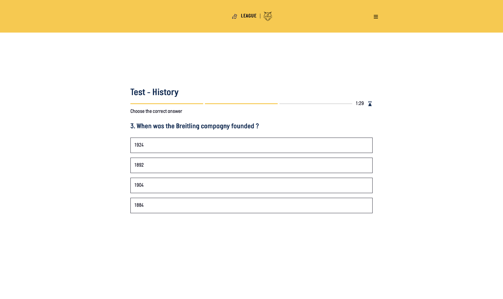

# 🕰️ Breitling League

## Tab of content
- [Introduction](#-introduction)
- [Architecture](#-architecture)
- [Installation](#-installation)
- [Access](#-access)
- [API](#-api)
- [Réalisation](#-réalisation)

---

## 🏁 Introduction
Breitling League est une application web permettant aux revendeurs de la marque Breitling de suivre des modules de formation, de passer des tests, de gagner des points, tout cela pour se qualifier à la Breitling Cup.

Elle s'appuie sur une architecture moderne full-stack avec une gestion des utilisateurs, des scores, des étapes et un suivi de progression.



---

## 🚧 Architecture

```
projet
├── backend/
├── frontend/
├── README.md
├── .gitignore
├── setup.sh
```

### Back-end

- **Framework**
    - Laravel 12.15.0
- **Bases de données**
    - MySQL
    - Construction :
        - `Migrations`
        - `Models`
        - `FormRequest`
        - `Controllers`
        - `Seeders`
- **Authentification**
    - Breeze
- **Routes**
    - api.php
    - Versionning et préfixes `…/api/v1/…`
    - La majorité sont protégées par un middleware `Sanctum`

### Front-end

- **Framework**
    - Vue.js
- **Vues**
    - `Login.vue`
    - `RegisterStep1.vue`
    - `RegisterStep2.vue`
    - `VerifyEmail.vue`
    - `Learning.vue`
    - `LearningCategory.vue`
    - `LearningModule.vue`
    - `LearningPath.vue`
    - `Profile.vue`
    - `Ranking.vue`
    - `Help.vue`
    - `Settings.vue`
    - `Privacy.vue`
    - `Terms.vue`
    - `Test.vue`
    - `Error404.vue`
- **Routes**
    - La navigation se fait avec `Vue-router`
- **Communication avec le back-end**
    - Les reqêtes HTTP vers l'API se font avec `Axios`
- **Design**
    - `CSS` (pas de framework UI)
    - Responsive (smartphone, desktop) mais Mobile-first

---

## 💻 Installation

### Prérequis
PHP 8.2+
Node.js 18+
Composer
MySQL
Mailhog

### GIT

1. Cloner le répértoire GIT

```bash
git clone https://github.com/floriansalvi/HEIG-VD_ProjArt_Noxeo.git
cd noxeo-breitling-league
```

### Back-end

1. Installer les dépendances

```bash
cd backend
composer install
```

2.  Configurer le fichier `.env`

```bash
cp .env.example .env
php artisan key:generate
```

3. Installer et lancer MySQL

```bash
brew services start mysql
```

4. Effectuer les migrations et les seeders

```bash
php artisan migrate
php artisan db:seed
```

5. Démarrer le serveur back-end

```bash
php artisan serve
```

6. Démarrer le SMTP (MailHog)

```bash
mailhog
```

### Front-end

1. Installer les dépendances

```bash
cd ../frontend
npm install
```

2. Démarrer le serveur front-end

```bash
npm run dev
```

### Setup

Un script permet d'automatiser toutes ces étapes en 2 commandes. Se placer à la racine du projet et effectuer :

```bash
chmod +x setup.sh
./setup.sh
```

---

## 🌐 Access

### Localhost

- Back-end : [http://localhost:8000](http://localhost:8000)
- Front-end : [http://localhost:5173](http://localhost:5173)
- Mailhog : [http://localhost:8025](http://localhost:8025)

Le port utilisé par l'application front-end peut être adapté mais, cela doit être fait manuellement dans les fichiers `/backend/config/cors.php` et `/backend/.env`

### Account

Voici les informations d'identification d'un compte déjà créé.'.

```
Pseudo : floflo
Email : florian.salvi@heig-vd.ch
Mot de passe : Heig2025
```

---

## 📂 API

1. Les route publiques

| Méthode | URI                              | Description                                    |
| ------: | :------------------------------- | :--------------------------------------------- |
|     GET | `/api/v1/registration-key/{key}` | Vérifie la validité d’une clé d’enregistrement |
|    POST | `/login`                         | Connexion d’un utilisateur                     |
|    POST | `/register`                      | Inscription d’un utilisateur                   |
|    POST | `/logout`                        | Déconnexion de l’utilisateur                   |

2. Les route privées

| Méthode | URI                                   | Description                                       |
| ------: | :------------------------------------ | :------------------------------------------------ |
|     GET | `/api/user`                           | Récupérer l'utilisateur authentifié               | 
|    POST | `/api/v1/user/verify`                 | Vérifie la clé de vérification email              | 
|    POST | `/api/v1/user/verify/resend`          | Renvoie une clé de vérification                   |
|     PUT | `/api/v1/user/update-password`        | Met à jour le mot de passe                        | 
|     PUT | `/api/v1/user/update-profile`         | Met à jour les infos de profil                    |
|  DELETE | `/api/v1/user/delete`                 | Supprime le compte utilisateur                    |
|     GET | `/api/v1/leaderboard`                 | Classement global + position de l'utilisateur     |
|     GET | `/api/v1/leaderboard/market`          | Classement par marché                             |
|     GET | `/api/v1/user/score`                  | Score de l'utilisateur connecté                   |
|     GET | `/api/v1/categories`                  | Liste toutes les catégories et leurs modules      |
|     GET | `/api/v1/categories/{categoryId}`     | Détails d'une catégorie spécifique                |
|     GET | `/api/v1/modules/{moduleId}/learning` | Blocs d’apprentissage d’un module                 |
|     GET | `/api/v1/modules/{moduleId}/steps`    | Étapes d’un module                                |
|     GET | `/api/v1/badges`                      | Liste tous les badges                             |
|     GET | `/api/v1/user/badges`                 | Badges de l’utilisateur connecté                  |
|     GET | `/api/v1/tests/{testId}`              | Détail d’un test, ses questions et choix          |
|     GET | `/api/v1/steps`                       | Liste toutes les étapes (et modules + catégories) |
|     GET | `/api/v1/steps/{stepId}`              | Détails d’une étape                               |
|     GET | `/api/v1/game-progress/{gameId}`      | Progression d’un jeu pour l’utilisateur           |
|    POST | `/api/v1/game-progress`               | Enregistre ou met à jour la progression d’un je   |
|     GET | `/api/v1/test-progress/{testId}`      | Progression d’un test pour l’utilisateur          |
|    POST | `/api/v1/test-progress`               | Enregistre ou met à jour la progression d’un test |
|     GET | `/api/v1/game-question-progress/{gameProgressId}/{gameQuestionId}` | Progression d’une question dans un jeu                      |
|    POST | `/api/v1/game-question-progress`      | Enregistre/update la progression d'une question   |

---

## 👥 Réalisation

**Malory Bossel**  
**Emma Chautems**  
**Lorie Crettex**  
**Cristian Pottier**  
**Florian Salvi**  

Haute École de Gestion et d'Ingénierie du Canton de Vaud  
Ingénierie des Médias  
Semestre S4 - 2025  
Classe M52-2